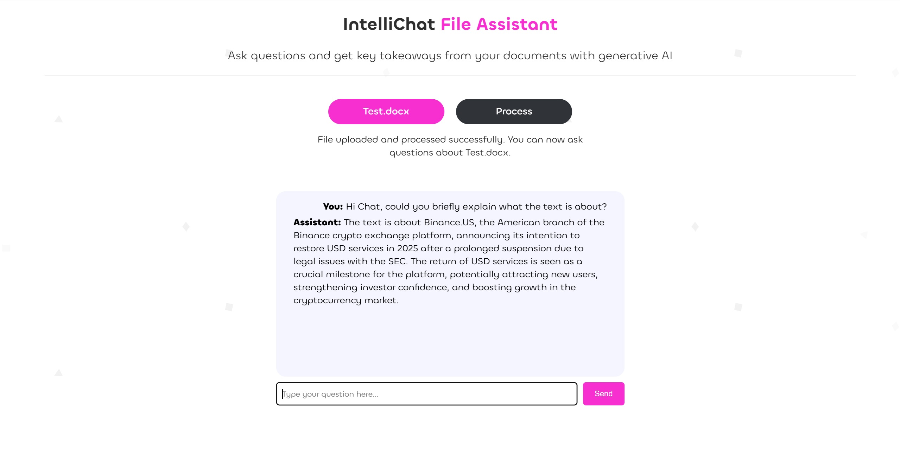

**IntelliChat File Assistant** 
This project is a Full Stack GenAI-powered application for uploading, processing, and interacting with file content. Users can upload files, parse their content into chunks, index them using embeddings, and ask questions via an interactive chat interface.

---

## Features
1. **File Upload**: Supports PDF and Word file uploads.
2. **Text Parsing**: Decomposes files into semantically logical chunks.
3. **Data Indexing**: Uses OpenAI embeddings (e.g., `text-embedding-ada-002`) for indexing.
4. **Interactive Chat**: Enables questions based on uploaded content.

## Tech Stack
---
### **Frontend**
- **React.js**: Client-side framework for building interactive user interfaces.
- **TypeScript**: Strongly typed language for React components and application logic.
- **CSS**: For styling and modern design.
- **Axios**: For HTTP requests to the backend.

### **Backend**
- **Node.js**: Runtime for executing JavaScript on the server.
- **Express.js**: Framework for building RESTful APIs.
- **TypeScript**: Strongly typed language for backend development.
- **OpenAI API**: Used for generating embeddings and GPT-based responses.
- **Multer**: Middleware for handling file uploads.
- **pdf-parse** and **mammoth**: Libraries for parsing PDF and Word documents.

### **Utilities and Tools**
- **Postman**: For testing and debugging API endpoints.
- **dotenv**: For managing environment variables securely.
- **compute-cosine-similarity**: For comparing embeddings.
---

## Demo

---

## Setup Instructions
### Requirements (make sure you have before you start)
- Node.js and npm installed.
- OpenAI API key.

### Steps
1. **Clone the repository**:
   ```bash
   git clone https://github.com/your-username/IntelliChat-File-Assistant.git
   cd IntelliChat-File-Assistant
   ```

2. **Install dependencies**:
   - Backend:
     ```bash
     cd backend
     npm install
     ```
   - Frontend:
     ```bash
     cd frontend
     npm install
     ```

3. **Set up environment variables**:
   - In `backend/.env`:
     ```env
     OPENAI_API_KEY=your_openai_api_key
     ```

4. **Run the application**:
   - Backend: `npm run dev` (in `backend` folder).
   - Frontend: `npm start` (in `frontend` folder).

5. **Access the app**:
   Open your browser and navigate to `http://localhost:3000`.

---

## Usage
1. **Upload Files**:
   - Upload a PDF or Word file.
   - The system parses and indexes the file in the background.

2. **Ask Questions**:
   - Once processing is complete, the chat interface becomes active.
   - Ask questions about the uploaded content and get responses.

---

## How It Works
1. **Parsing**: Extracts text from files and splits it into logical chunks.
2. **Indexing**: Generates embeddings for chunks using OpenAI.
3. **Querying**: Matches user questions with relevant chunks and generates responses using GPT.

---

## Credits

- Background patterns used in the application were sourced from [Free SVG Backgrounds](https://www.svgbackgrounds.com/set/free-svg-backgrounds-and-patterns/).


